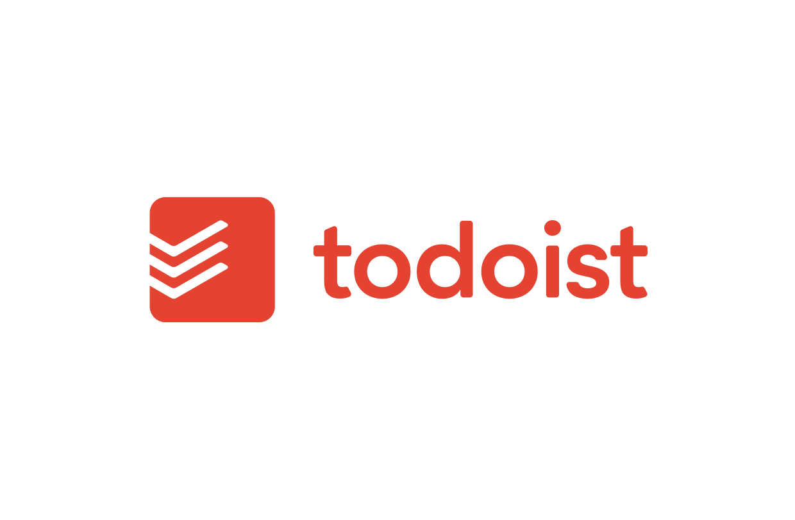

<h1 align="center">
    
</h1>

  <a href="#rocket-Technologies">Technologies</a>&nbsp;&nbsp;&nbsp;|&nbsp;&nbsp;&nbsp;
  <a href="#-project">Project</a>&nbsp;&nbsp;&nbsp;|&nbsp;&nbsp;&nbsp;
  <a href="#-layout">Layout</a>&nbsp;&nbsp;&nbsp;|&nbsp;&nbsp;&nbsp;
  <a href="#-how-to-contribute">How to contribute</a>&nbsp;&nbsp;&nbsp;|&nbsp;&nbsp;&nbsp;

 

## :rocket: Technologies

This project was developed with the following technologies:

- [React](https://reactjs.org) 
- [React Testing](https://testing-library.com/docs/react-testing-library/intro) 
- [SCSS](https://sass-lang.com/)
- [Firebase](https://firebase.google.com/) 

## 💻 Project

Todoist is a project that aims to help you organize your tasks.

## 🔖 Layout

:construction:

## 🤔 How to contribute

- Make a fork;
- Create a branck with your feature: `git checkout -b my-feature`;
- Commit changes: `git commit -m 'feat: My new feature'`;
- Make a push to your branch: `git push origin my-feature`.

After merging your receipt request to done, you can delete a branch from yours.

---

Made with Isaque Igor :wave: [Get in touch!](https://www.linkedin.com/in/isaqueigor/)
